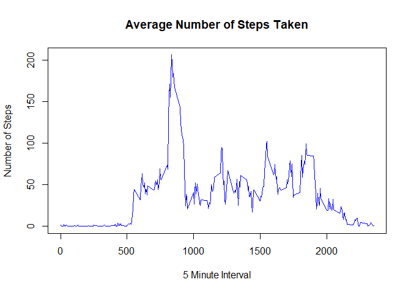

#Load and Process Data

## 1. Code for reading in the dataset and/or processing the data

Download the file, unzip and read the csv


```r
# Create data directory
if (!file.exists("data")) {
    dir.create("data")
}

# Download and unzip the activity.csv file
fileUrl <- "https://d396qusza40orc.cloudfront.net/repdata%2Fdata%2Factivity.zip"
download.file(fileUrl, destfile = "./data/activity.zip", method = "curl")
unzip("./data/activity.zip", exdir = "./data", overwrite = TRUE)

# Read the activity.csv file
activity <- read.csv("./data/activity.csv", header = TRUE)
```


# 2. Process/transform the data into a suitable format


```
## Warning: package 'lubridate' was built under R version 3.3.3
```

```
## Warning: package 'doBy' was built under R version 3.3.3
```


```r
# Create data time string
activity$datetimestr <- paste(activity$date, substr(paste0("000", as.character(activity$interval)), 
    nchar(activity$interval), nchar(activity$interval) + 4))

# Convert date time
activity$datetime <- as.POSIXlt(activity$datetimestr, format = "%Y-%m-%d %H%M")

# Create interval string (time)
activity$intervalstr <- paste(substr(activity$datetimestr, 12, 13), substr(activity$datetimestr, 
    14, 15), sep = ":")

# Calculate Day of Week, Weekend, and Weekend string
activity$DOW <- wday(activity$datetime)
activity$WE <- ifelse(activity$DOW %in% c(1, 7), TRUE, FALSE)
activity$weekday <- ifelse(activity$WE, "weekend", "weekday")

# Aggregate Total Steps by Date
totStep <- aggregate(steps ~ date, data = activity, sum)

# Aggregate Mean Steps by Interval
meanInter <- aggregate(steps ~ interval, data = activity, mean)
```

# What is the average daily activity pattern?

## 3. Mean and median number of steps taken each day


```r
# Calculate the mean and median total number of steps
meanStep <- mean(totStep$steps, na.rm = TRUE)
medianStep <- median(totStep$steps, na.rm = TRUE)
# mean step
meanStep
```

```
## [1] 10766.19
```

```r
# median step
medianStep
```

```
## [1] 10765
```


```r
hist(totStep$steps, breaks = 22, col = "blue", main = "Total Number of Steps Taken Each Day", 
    xlab = "Number of Steps Taken per Day", ylab = "Frequency")
```

<!-- -->

## 4. Time series plot of the average number of steps taken


```r
plot(meanInter$interval, meanInter$steps, type = "l", col = "blue", main = "Average Number of Steps Taken", 
    xlab = "5 Minute Interval", ylab = "Number of Steps")
```

<!-- -->

## 5. The 5-minute interval that, on average, contains the maximum number of steps


```r
meanInter[which.max(meanInter$steps), ]
```

```
##     interval    steps
## 104      835 206.1698
```

# Imputing missing values

## 6. Code to describe and show a strategy for imputing missing data

There are a number of days/intervals where there are missing values (coded as NA). 
Calculate and report the total number of missing values in the dataset (i.e. the total number of rows with NAs).


```r
# count all rows where value of steps is NA
sum(is.na(activity$steps))
```

```
## [1] 2304
```

Create a new dataset that is equal to the original dataset but with the missing data filled in.


```r
# Merge activity data and average steps per interval
clean <- merge(activity, meanInter, by.x = c("interval"), by.y = c("interval"))

# Overwrite the steps column if value is NA
clean$steps <- ifelse(!is.na(clean$steps.x), clean$steps.x, round(clean$steps.y, 
    digits = 0))
totCleanStep <- aggregate(steps ~ date, data = clean, sum)

# Reorganize data
clean <- subset(clean, select = c("steps", "date", "interval", "datetimestr", 
    "datetime", "intervalstr", "DOW", "WE", "weekday"))

# Compare Structures
str(activity)
```

```
## 'data.frame':	17568 obs. of  9 variables:
##  $ steps      : int  NA NA NA NA NA NA NA NA NA NA ...
##  $ date       : Factor w/ 61 levels "2012-10-01","2012-10-02",..: 1 1 1 1 1 1 1 1 1 1 ...
##  $ interval   : int  0 5 10 15 20 25 30 35 40 45 ...
##  $ datetimestr: chr  "2012-10-01 0000" "2012-10-01 0005" "2012-10-01 0010" "2012-10-01 0015" ...
##  $ datetime   : POSIXlt, format: "2012-10-01 00:00:00" "2012-10-01 00:05:00" ...
##  $ intervalstr: chr  "00:00" "00:05" "00:10" "00:15" ...
##  $ DOW        : num  2 2 2 2 2 2 2 2 2 2 ...
##  $ WE         : logi  FALSE FALSE FALSE FALSE FALSE FALSE ...
##  $ weekday    : chr  "weekday" "weekday" "weekday" "weekday" ...
```

## 7. Histogram of the total number of steps taken each day after missing values are imputed


```r
hist(totCleanStep$steps, breaks = 22, col = "blue", main = "Total Number of Steps Taken Each Day", 
    xlab = "Number of Steps Taken per Day", ylab = "Frequency")
```

<!-- -->

```r
# Calculate mean and median of the cleansed data
meanCleanStep <- mean(totCleanStep$steps)
medianCleanStep <- median(totCleanStep$steps)

# Compare mean
meanCleanStep
```

```
## [1] 10765.64
```

```r
meanStep
```

```
## [1] 10766.19
```

```r
# Compare median
medianCleanStep
```

```
## [1] 10762
```

```r
medianStep
```

```
## [1] 10765
```

# Are there differences in activity patterns between weekdays and weekends?

## 8. Panel plot comparing the average number of steps taken per 5-minute interval across weekdays and weekends


```r
# Create plot data
pd <- subset(clean, select = c("interval", "weekday", "steps"))
names(pd) = c("interval", "weekday", "steps")

# Create factors
pd$interval <- factor(pd$interval, exclude = "")
pd$weekday <- factor(pd$weekday, exclude = "")

# Summarize by interval and weekday
avgStepInter <- summaryBy(steps ~ interval + weekday, data = pd, FUN = mean)
avgStepInter$steps.mean <- round(avgStepInter$steps.mean, digits = 0)
names(avgStepInter) <- c("interval", "weekday", "steps")

xyplot(steps ~ interval | weekday, data = avgStepInter, type = c("l", "l"), 
    layout = c(1, 2), xlab = "Interval", xlim = c(0, 288), ylab = "Number of steps", 
    ylim = c(0, 250), scales = list(x = list(at = seq(0, 288, 60), labels = c("0000", 
        "0500", "1000", "1500", "2000", "2359")), y = list(at = seq(0, 250, 
        50), labels = c("0", "50", "100", "150", "200", "250"))), main = "Comparison of the Activity Patterns between Weekends and Weekdays")
```

<!-- -->


